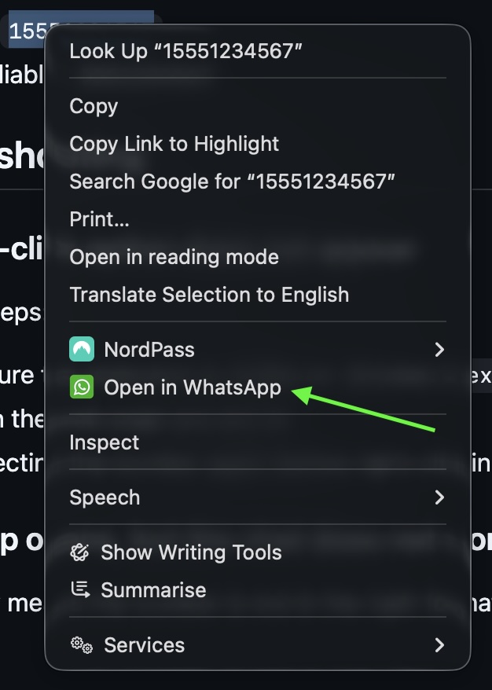
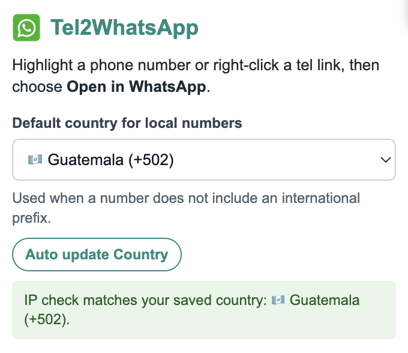

# Tel2WhatsApp

Tel2WhatsApp is a simple Chrome extension that lets you open phone numbers in WhatsApp from any web page.

## ✨ What it does

- Adds a right-click option called **Open in WhatsApp**
- Works with highlighted phone numbers
- Works with `tel:` phone links on websites
- Opens WhatsApp Web in a new tab
- Cleans up spaces, brackets, dashes, and other symbols automatically
- Can add the correct country code for local numbers

## 🚀 How to install it

1. [Download the ZIP file for this extension](https://github.com/hovr/tel2whatsapp/archive/refs/heads/main.zip).
2. Open the ZIP file and move the extracted folder somewhere it can stay (it needs to stay here for the extension to work).
3. Open Chrome and go to **Settings > Extensions**, or copy this into the address bar and press Enter:

   `chrome://extensions`

4. Turn on **Developer mode** in the top-right corner.
5. Click **Load unpacked**.
6. Select the extracted `tel2whatsapp` folder.
7. The extension should now appear in Chrome.
8. Click the puzzle-piece icon in Chrome and pin the extension.

## 📱 How to use it

### 🔢 Open a highlighted number

1. Highlight a phone number on a web page.
2. Right-click the highlighted number.
3. Click **Open in WhatsApp**.

### 🔗 Open a phone link

1. Right-click a clickable phone number link.
2. Click **Open in WhatsApp**.

Chrome will open WhatsApp Web in a new tab using that number.

## 🌍 Country code for local numbers

If a number does not include a country code, the extension can add one for you.

Open the extension popup and choose your default country, for example:

`🇬🇧 United Kingdom (+44)`

You can also click **Auto update Country** to detect your current country from your IP address and save it automatically.

Examples:

- `00441234223388` opens as `+441234223388`
- `01234223388` with United Kingdom selected opens as `+441234223388`
- `79374065` with Guatemala selected opens as `+50279374065`

If the detected IP country does not match your saved country, the popup will show a warning. If you are using a VPN it could be the issue.

## 🔄 Updating the extension

When a newer version is available, the popup will show an update notice.

To update:

1. Download the latest ZIP file.
2. Replace your old extension folder with the new extracted folder.
3. Open Chrome and go to **Settings > Extensions**.
4. Click the reload button on the Tel2WhatsApp card.

## ⬇️ Download

[Download Tel2WhatsApp here](https://github.com/hovr/tel2whatsapp/archive/refs/heads/main.zip)
